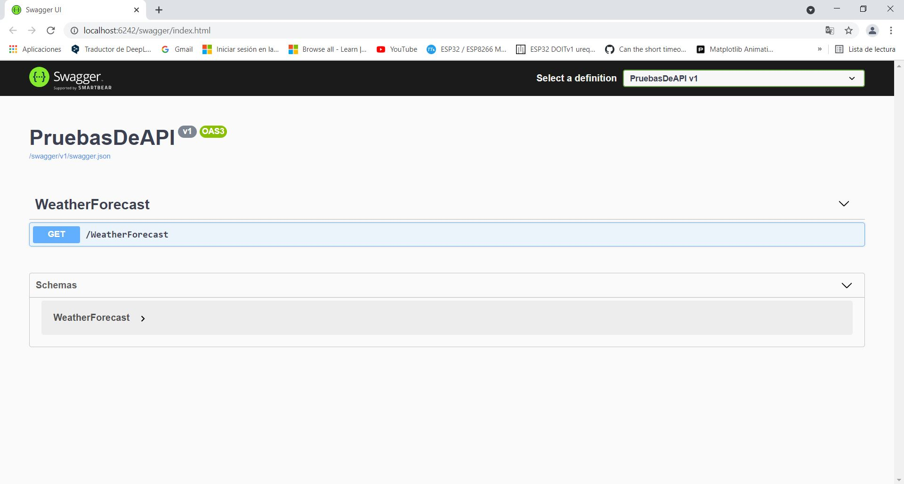
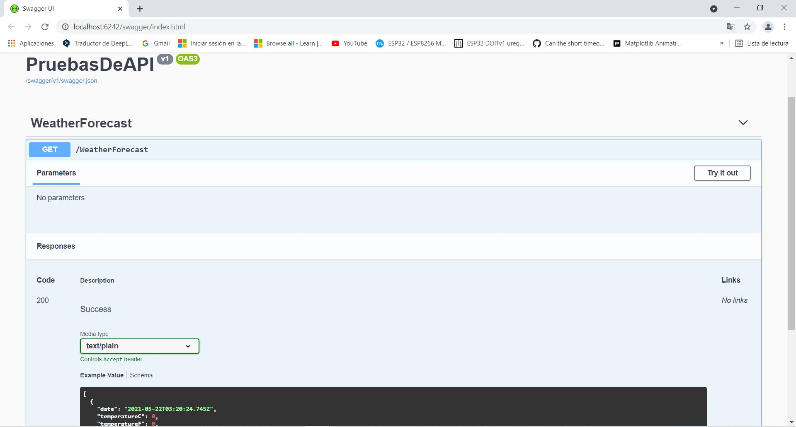

# Publicacion de una API web ASP.NET Core en Azure

> Taller impartido en BeeHack 2021

El objetivo principal del taller es la publicación de una API web hecha con ASP.NET Core en un App Service de Microsoft Azure.

Hablaremos sobre las consideraciones de seguridad al crear una API y ver cómo Azure nos facilita el control de acceso mediante el uso de API Management y documentación automática con un documento OpenAPI.

Como ejemplo de aplicación usaremos la API publicada en Azure en una aplicación real donde un usuario solicita cierta información a un chatbot y éste hace una solicitud con la API para conocer la respuesta a la consulta del usuario.

## Requisitos

### IDE

- [Visual Studio Community 2019](https://visualstudio.microsoft.com/es/vs/community/)
- [Visual Studio Code](https://code.visualstudio.com/download)

*Extensión*
- C#

### Dependencias

- Swashbuckle

### Suscripción de Azure

- [Prueba gratuita](https://azure.microsoft.com/es-mx/free/search/?&ef_id=EAIaIQobChMIoo38pqXc8AIVgozICh2Elw7lEAAYASAAEgL7aPD_BwE:G:s&OCID=AID2100073_SEM_EAIaIQobChMIoo38pqXc8AIVgozICh2Elw7lEAAYASAAEgL7aPD_BwE:G:s&gclid=EAIaIQobChMIoo38pqXc8AIVgozICh2Elw7lEAAYASAAEgL7aPD_BwE)

## Pasos

1. Crear API desde plantilla en Visual Studio Community 2019
Abre Visual Studio, da clic en Crear un nuevo proyecto y en los filtros selecciona C# y aplicación web.

Escribe un nombre y el directorio donde guardarás tu proyecto. Puedes activar o desactivar la opción para certificado SSL según sea el caso, por el momento y fines del taller se desactivará esta opción, pero cabe recalcar que en una aplicación real es importante implementarlo. También es importante verificar que tengas activada la opción de OpenAPI que aparece al final de ese menú ya que la utilizaremos en Azure posteriormente.

Al terminar este paso vamos a verificar que todo esté en orden con nuestra API. Damos clic en IIS Express en la parte superior para ejecutar y debería abrirse en el navegador la documentación de tu API. Esta se irá modificando conforme modifiques la API ya que utilizaremos un paquete que implementa la definición de OpenAPI.



No trates de abrir la documentación o usar la API desde otra computadora porque no va funcionar.

Ahora... Si das clic en el único método HTTP que aparece verás información que puede ayudar a tus usuarios o a ti mismo a recordar la sintáxis que requiere tu API, es decir, si necesita algún parámetro, las respuestas que regresa, ejemplos de uso y pruebas desde la documentación.



Además del index.html podemos consultar el archivo que contiene la información de nuestra API.

Añade /swagger/v1/swagger.json al endpoint.

Ahora veremos como implementar una API más personalizada. Supongamos que una Pizzería necesita actualizar los productos disponibles de cada tienda en su página web, con el objetivo de que los clientes sepan lo que está disponible.

2. Añade Swagger UI para producción
Las plantillas de Visual Studio no colocan esta sección por defecto sino que tendremos que colocarla nosotros para visualizar nuestra documentación en el endpoint de nuestro app service.

Añade reemplaza la función Configure con el código siguiente en Startup.cs
```
public void Configure(IApplicationBuilder app, IWebHostEnvironment env)
        {
            /* === SwaggerUI BEGIN === */
            app.UseSwagger(c =>
            {
                c.PreSerializeFilters.Add((swagger, httpReq) => {
                    var server = new OpenApiServer() { Url = $"{httpReq.Scheme}://{httpReq.Host.Value}" };
                    swagger.Servers = new List<OpenApiServer>() { server };
                });
            });
            app.UseSwaggerUI(c => c.SwaggerEndpoint("/swagger/v1/swagger.json", "PizzaApi v1"));
            /* === SwaggerUI END === */

            if (env.IsDevelopment())
            {
                app.UseDeveloperExceptionPage();
            }

            app.UseHttpsRedirection();

            app.UseRouting();

            app.UseAuthorization();

            app.UseEndpoints(endpoints =>
            {
                endpoints.MapControllers();
            });
```

3. Añadir controladores y servicios
Crea una carpeta dentro del proyecto llamada Models. Luego da clic derecho sobre la carpeta, selecciona Agregar y luego Nuevo elemento.

Al seleccionar esta opción aparece un menú con diferentes tipos de archivos, deberás escoger el que dice Archivo de código.

Pega el siguiente código

```
namespace PizzaApi.Models
{
    public class Pizza
    {
        public int Id { get; set; }
        public string Name { get; set; }
        public bool Discount { get; set; }
    }
}
```

Considera que el namespace debe ser igual al nombre de tu proyecto, en mi caso fue PizzaApi. Ahora guarda el archivo como Pizza.cs con clic derecho en el archivo.

Repite este paso pero con una carpeta llamada Services y un archivo llamado PizzaService.cs dentro de esa carpeta.

```
using PizzaApi.Models;
using System.Collections.Generic;
using System.Linq;

namespace PizzaApi.Services
{
    public static class PizzaService
    {
        static List<Pizza> Pizzas { get; }
        static int nextId = 3;
        static PizzaService()
        {
            Pizzas = new List<Pizza>
            {
                new Pizza { Id = 1, Name = "Pepperoni", Discount = false },
                new Pizza { Id = 2, Name = "Hawaiana", Discount = true }
            };
        }

        public static List<Pizza> GetAll() => Pizzas;

        public static Pizza Get(int id) => Pizzas.FirstOrDefault(p => p.Id == id);

        public static void Add(Pizza pizza)
        {
            pizza.Id = nextId++;
            Pizzas.Add(pizza);
        }

        public static void Delete(int id)
        {
            var pizza = Get(id);
            if(pizza is null)
                return;

            Pizzas.Remove(pizza);
        }

        public static void Update(Pizza pizza)
        {
            var index = Pizzas.FindIndex(p => p.Id == pizza.Id);
            if(index == -1)
                return;

            Pizzas[index] = pizza;
        }
    }
}
```

Dentro de la carpeta Controllers añade un archivo PizzaController.cs con el siguiente código

```
using System.Collections.Generic;
using System.Linq;
using Microsoft.AspNetCore.Mvc;
using PizzaApi.Models;
using PizzaApi.Services;

namespace PizzaApi.Controllers
{
    [ApiController]
    [Route("[controller]")]
    public class PizzaController : ControllerBase
    {
        public PizzaController()
        {
        }

        [HttpGet]
		public ActionResult<List<Pizza>> GetAll() =>
		    PizzaService.GetAll();

        [HttpGet("{id}")]
		public ActionResult<Pizza> Get(int id)
		{
		    var pizza = PizzaService.Get(id);

		    if(pizza == null)
		        return NotFound();

		    return pizza;
		}

        [HttpPost]
		public IActionResult Create(Pizza pizza)
		{            
		    PizzaService.Add(pizza);
		    return CreatedAtAction(nameof(Create), new { id = pizza.Id }, pizza);
		}

        [HttpPut("{id}")]
		public IActionResult Update(int id, Pizza pizza)
		{
		    if (id != pizza.Id)
		        return BadRequest();

		    var existingPizza = PizzaService.Get(id);
		    if(existingPizza is null)
		        return NotFound();

		    PizzaService.Update(pizza);           

		    return NoContent();
		}

        [HttpDelete("{id}")]
		public IActionResult Delete(int id)
		{
		    var pizza = PizzaService.Get(id);

		    if (pizza is null)
		        return NotFound();

		    PizzaService.Delete(id);

		    return NoContent();
		}
    }
}
```

4. Publicar a Azure
Da clic derecho en el proyecto y selecciona publicar, una ventana con varias opciones debería aparecer y dependiendo de tus necesidades tendrías que escoger la adecuada. Para este tutorial selecciona Azure y luego Azure App Service. Para estos pasos primero deberas ingresar tus credenciales de Azure, de lo contrario no será posible publicar.

Luego pon tu suscripción, grupo de recursos, instancia de App service, en caso de no tenerlas puedes crearlo desde ahí.

Después de tener un plan App service habrá una opción que dice API Management APIs, esa opción la omitiremos por el momento. Finalmente da clic en publicar.

Tardará de 1 - 2 minutos y al terminar notarás que la página pareciera que no sirve al probarla en el navegador. Sin embargo, eso se debe a que no hay nada en el endpoint base, sino que debes añadir /swagger/index.html para ver tu documentación

5. Probar la API con el endpoint del App service
Copiar el endpoint en el navegador y añadir /Pizza para hacer una solicitud GET.

Realizar peticiones POST desde algún programa como POSTMAN o crear un script en cualquier lenguaje para hacer una solicitud.

6. Integrar API Management
Para integrar el recurso lo primero que debemos hacer es tener a la mano el endpoint donde está ubicado swagger.json.

Luego buscamos el recurso API Management y lo creamos.

En la parte de APIs buscamos API, seleccionamos Crear desde definición y ponemos OpenAPI. En esa sección pegamos la dirección del swagger.json y los campos deberían actualizarse automáticamente.

Al finalizar con esta parte podemos ver los métodos que añadimos y probarlos desde ahí.

Ahora un buen experimento es repetir lo que hicimos pero con el nuevo endpoint. Copiamos y pegamos en el navegador y añadimos /Pizza para hacer una solicitud GET.

Eso nos da un status code 401 que significa que la solicitud no fue autorizada por las credenciales que se dieron, debemos añadirlas en nuestra  solicitud.

7. Usa la API en tus aplicaciones
De preferencia utilizando el endpoint de API Management.

## Contacto

Twitter: [@OscarSantosMu](https://twitter.com/OscarSantosMu)  
Instagram: [oscarsantosmu](https://instagram.com/oscarsantosmu)